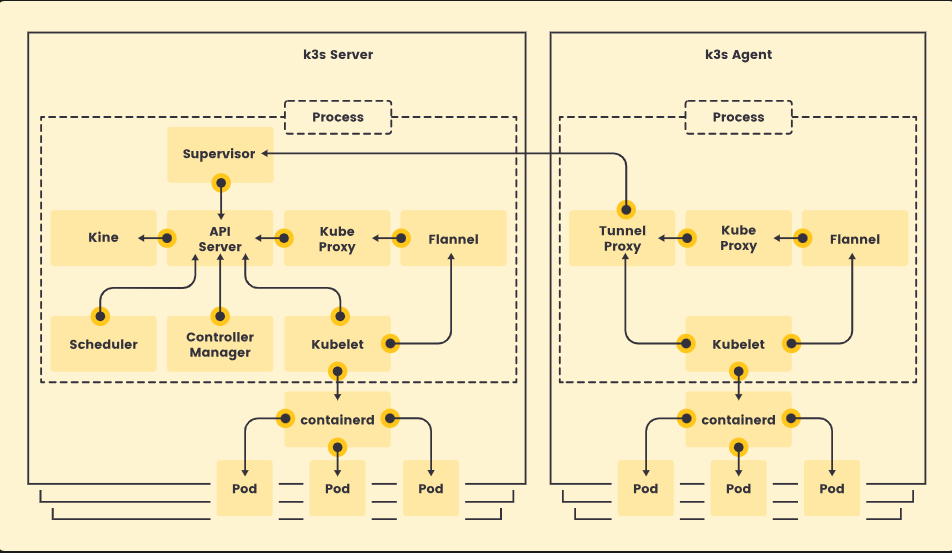
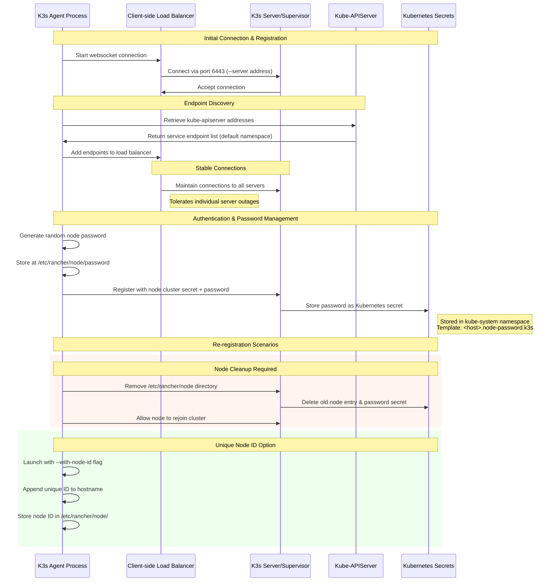

# CI/CD

## Table of Contents

- [Vagrant](#vagrant)
  - [Key Components](#key-components)
  - [Vagrant File](#vagrant-file)
  - [What is Vagrant?](#what-is-vagrant)
  - [Common Commands](#common-commands)
    - [Initialize Environment](#initialize-environment)
    - [Start Environment](#start-environment)
    - [Access Virtual Machine](#access-virtual-machine)
  - [Manage Environment Lifecycle](#manage-environment-lifecycle)
  - [Provision development environment](#provision-development-environment)
    - [Run Provisionning Scripts](#run-provisionning-scripts)
  - [Share resources between host and guest machines](#share-resources-between-host-and-guest-machines)
    - [Configure port forwarding](#configure-port-forwarding)
    - [Enable Folder Synchronization](#enable-folder-synchronization)
  - [Manage multi-machine environments](#manage-multi-machine-environments)
    - [Example](#example)
- [Creating an image](#creating-an-image)
- [Global Vagrant Box config](#global-vagrant-box-config)
- [K3s](#k3s)
  - [What Is K3S](#what-is-k3s)
  - [K3S Architecture](#k3s-architecture)
  - [Single-server Setup with an Embedded DB and High-Availability K3s](#single-server-setup-with-an-embedded-db-and-high-availability-k3s)
  - [How Agent Node Registration Works](#how-agent-node-registration-works)
    - [Key Components:](#key-components-1)
    - [Important Notes:](#important-notes)
  - [K3S Installation](#k3s-installation)
    - [Running Installtion Script Causes](#running-installtion-script-causes)
- [Side Notes](#side-notes)
  - [VirtualBox & Secure Boot (BIOS)](#virtualbox--secure-boot-bios)
- [Further](#further)

---

## Vagrant

### Key Components

- **Vagrantfile:** Configuration file for the environment.
- **Vagrant Box:** Base image for virtual machines.
- **Provider:** The virtualization backend (e.g., VirtualBox).

### Vagrant File

```ruby
Vagrant.configure("2") do |config|
# Box
    config.vm.box = "box name"
    config.vm.box_version = "box version"

# Provisioning
    # runs a provision using a predefined file
    config.vm.provision "shell", name: "install-dependencies", path: "instal-dependendcies.sh"
    # runs inline shell provision, the provision below will not `run` when running `vagrant up`
    # an be rerun with vagrant provision --provision-with inline-provision
    config.vm.provision "shell", name: "inline-provision", run: "never", inline: <<-SHELL
        docker compose restart
    SHELL

```

### What is Vagrant?

Vagrant is a tool by Hashicorp for isolating development environments, enabling teams to collaborate efficiently.

- **Providers:** Hypervisors such as VirtualBox, VMWare, etc.
- **Vagrantfile:** Essential for defining the environment.
- **Workflow:**
    1. **Scope:** Identify OS, tools, and dependencies needed.
    2. **Author:** Write the `Vagrantfile`.
    3. **Manage:** Use Vagrant commands to control the environment.
    4. **Share:** Distribute the `Vagrantfile` or packaged box for consistent setup.

---

### Common Commands

#### Initialize Environment

```bash
vagrant init [box_name] [box_url]
```
Initializes the environment. You can specify a box name and URL.

#### Start Environment

```bash
vagrant up
```
- Fetches the box from the registry (if not local).
- Configures the provider.
- Applies the configuration from the Vagrantfile.

#### Access Virtual Machine

```bash
vagrant ssh
```
- Sets up a secure SSH connection using an auto-generated key.

```bash
lsb_release -a
```
- Verify you are inside the guest machine.

```bash
logout
```
- Exit the guest machine.

---

### Manage Environment Lifecycle

- `vagrant suspend` — Save and pause the machine state.
- `vagrant resume` — Resume the suspended machine.
- `vagrant halt` — Gracefully power off the machine (clean state on next `up`).
- `vagrant destroy` — Remove the VM (does not delete the box).
- `vagrant box remove <box_name>` — Delete the box from your system.

---

### Provision development environment

> _You can automate software installation and configuration using provisioning scripts in your Vagrantfile (e.g., shell, Ansible, Puppet, etc.)._

#### Run Provisionning Scripts

```bash
vagrant up
```
This command inializes the enviroment and runs all provision scripts
If the machine already exists, the command will not run the provision

```bash
vagrant provision
```
Run provision scripts while the machine is running 

```bash
vagrant up --provision
```
If you want to force provision to be run on machine start up runs

---

### Share resources between host and guest machines

#### Configure port forwarding


```ruby
    Vagrant.configure("2") do |config|
        # some code
        config.vm.network "forwarded_port", guest: "8080", host: "8080"
        # some code
    end
```
Forwards the port from the guest machine to the host machine 

#### Enable Folder Synchronization

```ruby
    Vagrant.configure("2") do |config|
        config.vm.sync_folder "path_to_folder_on_host", "path_to_folder_on_guest", create: true
    end
```
Sync the folder in host machine with the one on the guest machine (somewhat like the logic in docker of volumes)

### Manage multi-machine environments

> _To simplify machine networking `libnss-mdns` and `avahi-daemon` can be installed on each machine

```bash
    # Destroy old machine, if it exists could cause conflicts
    vagrant destory
```

- Destroy the existing machine
- Create a script for installing common things that should exists in all VMs
- 


#### Example

```ruby
# Services Configuration Reference
SERVICES = {
  'backend' => {
    ip: '192.168.56.11',
    ports: { 8080 => 8080 }
  },
  'frontend' => {
    ip: '192.168.56.12',
    ports: { 8081 => 8081 }
  }
}

Vagrant.configure("2") do |config|
    # common configuration
    config.vm.box = "hashicorp-education/ubuntu-24-04"
    config.vm.box_version = "0.1.0"

    # Common provisioning script for all VMs
    config.vm.provision "shell", name: "common", path: "common-dependencies.sh"

    config.vm.define "frontend" do |frontend|
        frontend.vm.hostname = "frontend"
        frontend.vm.network "private_network", ip: SERVICES['frontend'][:ip]
        frontend.vm.network "forwarded_port", guest: 8080, host: 8080
        # frontend.vm.synced_folder ...
        
        frontend.vm.provision "shell", name: "start-frontend", inline: <<-SHELL
            #... some code
            
            # Get frontend IP dynamically (with 1 minute timeout)
            for i in {1..30}; do
                if BACKEND_IP=$(getent hosts backend.local | awk '{print $1}'); then
                break
                fi
                echo "Waiting for backend.local to be resolvable..."
                sleep 2
            done

            #... some code
            
            docker run -d -p 8081:8081 \
                --add-host backend.local:${BACKEND_IP} \
                frontend
        end
    end


end

```

--- 

## Creating an image

- Minimal ubuntu server
- port mapping for ssh
- passwordless sudo access
- apt update/upgrade/reboot
- install additional packages
- install guest additions
- customize files/config
- vagrant public key
- apt clean/autoremove
- truncate log files
- clean history

> **Note:**  
> Before packaging, make sure your VM is powered off and the name matches exactly as shown in VirtualBox.  
> If you get `VM not created. Moving on...`, check the VM name and that it is managed by VirtualBox.
>  
> **Vagrant needs the VM name `.vbox`.
> The VM name is usually the folder name in `~/VirtualBox VMs/` and as listed in VirtualBox Manager.  
> For example, if you see `~/VirtualBox VMs/ubuntu_24_server/ubuntu_24_server.vbox`, your VM name is `ubuntu_24_server`.

vagrant package --base ubuntu_24_server --output ubuntu_24_server.box
ls ~/VirtualBox\ VMs/

```bash
# List files in the VM directory to verify VM name
ls ~/VirtualBox\ VMs/

# Add vagrant user to sudoers with passwordless sudo
echo 'vagrant ALL=(root) NOPASSWD: ALL' | sudo tee /etc/sudoers.d/vagrant

# Update package lists
sudo apt update

# Upgrade installed packages
sudo apt upgrade

# Reboot
sudo reboot

# Install useful packages
sudo apt install -y build-essential dkms linux-headers-$(uname -r) curl wget git vim bash-completion nano tree

# Install VirtualBox Guest Additions (after mounting the CD)
sudo /mnt/VBoxLinuxAdditions.run

# Zeroing disk for better compression 
sudo dd if=/dev/zero of=/empty bs=1M
sudo rm -f /empty

# Clean up apt cache and remove unnecessary packages
sudo apt autoremove -y
sudo apt clean
sudo rm -rf /var/lib/apt/lists/*

# Truncate all log files
sudo find /var/log -type f -exec truncate -s 0 {} \;

# Add vagrant public key for SSH access
curl -L https://raw.githubusercontent.com/hashicorp/vagrant/master/keys/vagrant.pub -o ~/.ssh/authorized_keys

# Clear bash history
history -c
history -w
```

---

## Global Vagrant Box config

```bash
sudo mkdir -p /opt/vagrant/boxes
sudo mv 'your_gzip_box' /opt/vagrant/boxes
sudo chmod 644  /opt/vagrant/box/'your_gzip_box'
cd /opt/vagrant/box/
vagrant box add 'desired_name_for_box' 'your_gzip_box'
# vagrant unpacks the box in ~/.vagrant.d/boxes
```


# K3s

## What Is K3S

K3S is lightweight kubernetes, highly available certified distribution of kubernetes, can work in a constrainted enviromenent where ressources are critical. K3S is served as a less than 70Mb binary file.

Great For:
- IOT
- CI
- Embeded K8S
- Homelab
- Edge
- ...

K3S is fully compliant with k8s with following enhancement
- lightweight database based on sqlite3, etcd and other options are available
- Distributed as a single binary or minimal container image
- Packages the required dependencies for easy "batteries-included" cluster creation:
    - containerd / cri-dockerd container runtime (CRI)
    - Flannel Container Network Interface (CNI)
    - CoreDNS Cluster DNS
    - ...
- ...

## K3S Architecture

- A **Server Node** is defined as a running host machine, running the command `k3s server` with a database component and control-plane managed by K3S
- A **Agent Node** is defined as a running host machine, runnning the command `k3s agent` witout any control-plane nor a database componenent
- Both server and agent runs container runtime, kubelet, and CNI.



## Single-server Setup with an Embedded DB and High-Availability K3s

- The server node can run with `embeded database` or `external database`
    - `embeded database` when you have a single server node cluster
    - `external database`when kubertnetes control-plane availibility is critical, you have multiple server nodes. You can use etcd, PostgresSQL or MySQL

## How Agent Node Registration Works



### Key Components:

- **Websocket Connection**: Initiated by k3s agent process
- **Client-side Load Balancer**: Maintains endpoint list and stable connections
- **Port 6443**: Default connection port to supervisor and kube-apiserver
- **Password Storage**: `/etc/rancher/node/password` (agent) and `kube-system` namespace (server)
- **Secret Template**: `<host>.node-password.k3s` format for node passwords

### Important Notes:

- **Node Cleanup**: Remove `/etc/rancher/node` directory and delete cluster node entry for re-registration
- **Unique Node IDs**: Use `--with-node-id` flag for frequent hostname reuse scenarios
- **High Availability**: Load balancer tolerates individual server outages


## K3S Installation

K3S can be installed using official install script
- K3S can be install as a service on systemd or open rc based system
- Download K3S binary and run it manually

```bash
# server node
curl -sfL https://get.k3s.io | INSTALL_K3S_EXEC="--node-ip=<ip> --advertise-ip=<ip>" sh -

# Agent node | `K3S_URL` causes the installer to install K3S as an agent
curl -sfL https://get.k3s.io | INSTALL_K3S_EXEC="--node-ip=<ip>" K3S_URL=https://myserver:6443 K3S_TOKEN=mynodetoken sh -
```
- `--advertise-address value` (listener) IPv4/IPv6 address that apiserver uses to advertise to members of the cluster (default: node-external-ip/node-ip)

- `--node-ip value, -i value` (agent/networking) IPv4/IPv6 addresses to advertise for node


- Installing only the server node is considered a fully functional kubernetes cluster, with Database, control-plane, Kublet, container runtime and is ready to host a workload of pods.

### Running Installtion Script Causes

- Configuring K3S to restart if node crashes or restart
- Installing Kubectl, crictl, ... and additional utilies
- Kubeconfig is written at `/etc/rancher/k3s/k3s.yaml`, and kubectl installed by K3S will use it.

- Agent will register to the server listenning on the given address
- `K3S_TOKEN` can be found at `/var/lib/rancher/k3s/server/node-token` on your server node
- If some machines have same name, provide K3S_NODE_NAME for each node with a unique name

> Note: You may need to change permission of `/etc/rancher/k3s/k3s.yaml` `chmod 644 /etc/rancher/k3s/k3s.yaml` 


# Side Notes

## VirtualBox & Secure Boot (BIOS)

**Environment:**
- Ubuntu
- VirtualBox
- Secure Boot enabled in BIOS

During VirtualBox installation, a Machine Owner Key (MOK) is created. Set a password when prompted. On reboot, enter this password to sign kernel modules, allowing VirtualBox access.

To disable Kernel-based Virtual Machine (KVM) and give VirtualBox exclusive access to hardware virtualization:

```bash
sudo modprobe -r kvm_intel kvm
```
> _Note: KVM may reload after reboot._

---

## Further

- https://www.youtube.com/watch?v=DEqS-mqba54&ab_channel=theurbanpenguin
- https://developer.hashicorp.com/vagrant/tutorials
- https://developer.hashicorp.com/vagrant/docs/provisioning/ansible
- https://kubernetes.io/docs/concepts/overview/
- https://kubernetes.io/docs/concepts/overview/components/
- https://kubernetes.io/docs/concepts/architecture/
- https://docs.k3s.io/
- https://docs.k3s.io/architecture
- https://docs.k3s.io/quick-start#install-script
- https://docs.k3s.io/cli/server